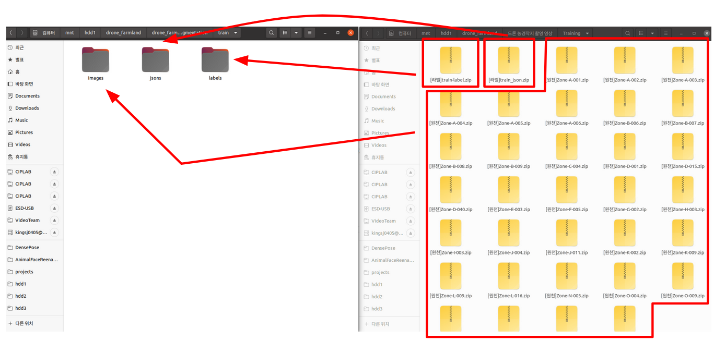

# Baseline for Projects of Computer Vision with Deep Learning(CSI6072, 2021 Fall)

## Table of Contents

- Summary
    - Course Information
    - The purpose of this repository
    - Environment Setup
- Projects
    - Project 2
        - Information
        - Dataset
        - Training
        - Inference
        - Submission
    - Project 1
        - Information
        - Dataset
        - Training
        - Inference
        - Submission

## Summary

### Course Information

- Professor: [Seon Joo Kim](https://sites.google.com/site/seonjookim/)
- Computer Vision with Deep Learning, CSI6072, (2021 Fall)
- [Syllabus](ysweb.yonsei.ac.kr:8888/curri120601/curri_pop2.jsp?&hakno=CSI6702&bb=01&sbb=00&domain=A&startyy=2021&hakgi=2&ohak=10421)

### The purpose of this repository

- Provide baseline
    - You can extend the baseline for a better solution
- Provide submission csv file generation
    - Your submitted result(CSV file) and model(.pth file) should correspond to each other
- Provide useful script to pre-process data

### Environment Setup

You can set up this part as your own if compatible

```
# Desired Setup
(pytorch19) user@host:/projects/example-code# python --version
Python 3.9.6
(pytorch19) user@host:/projects/example-code# pip freeze | grep torch
torch==1.9.0
torchaudio==0.9.0a0+33b2469
torchvision==0.10.0
```

The recommended way is as follows

1. Install [Miniconda](https://docs.conda.io/en/latest/miniconda.html)
2. Run following commands

```
conda create -n pytorch19
conda activate pytorch19
conda install pytorch torchvision torchaudio cudatoolkit=10.2 -c pytorch
pip install -r requirements.txt
```

## Projects

### Project 2

#### Information

- Drone Farmland Semantic Segmentation
- [Kaggle Leaderboard](https://www.kaggle.com/c/yonsei-csi6702-2021fall-project2/leaderboard)
- [Test Dataset - Kaggle](https://www.kaggle.com/c/yonsei-csi6702-2021fall-project2/data)
- [Training Dataset - AIHub](https://aihub.or.kr/aidata/30725)
- Check kaggle overview for more information(e.g. What is hyspectral image and tif format?)

#### Dataset

You need to download and preprocess data from [aihub](https://aihub.or.kr/aidata/30725) for security reasons.

- !!!!!You are not allowed to train the model with 'Validation' dataset!!!!!
- !!!Being approved and downloading the data could take some time, so start right now!!!
- The entire 'Training' dataset is 3TB. You need to download a subset of the dataset if disk size is not enough.

The desired structure of the dataset is as follows.



```
(pytorch19) user@host:/projects/examples-code# tree -d data/drone_farmland_semantic_segmentation
data/drone_farmland_semantic_segmentation
|-- test
|-- train
|   |-- images
|   |   |-- Zone-A-001
|   |   |-- Zone-A-002
            ...
|   |   |-- Zone-Q-002
|   |   `-- Zone-R-002
|   |-- jsons
|   |   |-- Zone-A-001
|   |   |-- Zone-A-002
            ...
|   |   |-- Zone-R-006
|   |   `-- Zone-R-007
|   `-- labels
|       |-- Zone-A-001
|       |-- Zone-A-002
            ...
|       |-- Zone-R-006
|       `-- Zone-R-007
`-- val: !!!!!Do not utilize val to train model!!!!!

1411 directories
```

- You can use `tools/project2_preprocess_data.py` to generate 'meta.json' with data paths for the baseline framework
- `meta.json` file will be used in `src/dataset/drone_farmland_dataset.py` for more information

```
PYTHONPATH=$PYTHONPATH:. python tools/project2_preprocess_data.py
# This will generate meta.json for dataset of the framework
```

#### Training

Many options are available. Check `src/config/cfg_project2.py` and `experiment/000_unet_baseline.yaml` for more information.

You can extend other options by adding other classes to the package like `src.losses`, `src.models`.

Also you can edit `src/trainer.py` for a more complicated learning scheme.

```
PYTHONPATH=$PYTHONPATH:. python tools/project2_train.py --cfg experiment/000_unet_baseline.yaml
PYTHONPATH=$PYTHONPATH:. python tools/project2_train.py --cfg experiment/000_unet_baseline.yaml \
    TRAINER.LEARNING_RATE 1e-4 \
    OUTPUT_DIR outputs_unet_small_lr
PYTHONPATH=$PYTHONPATH:. python tools/project2_train.py --cfg experiment/000_unet_baseline.yaml \
    TRAINER.LOSS dice_loss \
    OUTPUT_DIR outputs_unet_dice
PYTHONPATH=$PYTHONPATH:. python tools/project2_train.py --cfg experiment/000_unet_baseline.yaml \
    TRAINER.RESUME True \
    MODEL.WEIGHTS outputs_unet/model_final.pth \
    OUTPUT_DIR outputs_unet_resume
```

#### Inference

```
PYTHONPATH=$PYTHONPATH:. python tools/project2_inference.py --cfg experiment/000_unet_baseline.yaml
```

#### Submission

1. Check `Training` to train model
2. Check `Inference` to inference test data and generate csv at `{OUTPUT_DIR}/submission.csv`
3. Edit the name of CSV file(e.g. `2019324058.csv`)
4. Upload CSV file to [Kaggle](https://www.kaggle.com/c/yonsei-csi6702-2021fall-project2/overview)

### Project 1

#### Information

- Korean Food Classification
- [Kaggle Leaderboard](https://www.kaggle.com/c/yonsei-csi6702-2021fall-project1/leaderboard)
- [Refined Dataset - Kaggle](https://www.kaggle.com/c/yonsei-csi6702-2021fall-project1/data)


#### Dataset

You can download data from [Data section of Kaggle](https://www.kaggle.com/c/yonsei-csi6702-2021fall-project1/data)

This is the structure of data directory

```
(pytorch19) user@host:/projects/example-code# tree -d data/korean_food_classification_data 
data/korean_food_classification_data
|-- test
|   `-- test
|-- train
|   `-- train
`-- val
    `-- val
```

#### Training

```
PYTHONPATH=$PYTHONPATH:. python tools/project1_train.py
```

#### Inference

```
PYTHONPATH=$PYTHONPATH:. python tools/project1_inference.py
```

#### Submission

1. Train your model with your code
2. Edit and Run `inference_baseline.py` to generate CSV file(`submission.csv`)
3. Edit the name of CSV file(e.g. `2019324058.csv`)
4. Upload CSV file to [Kaggle](https://www.kaggle.com/c/yonsei-csi6702-2021fall-project1/overview)
